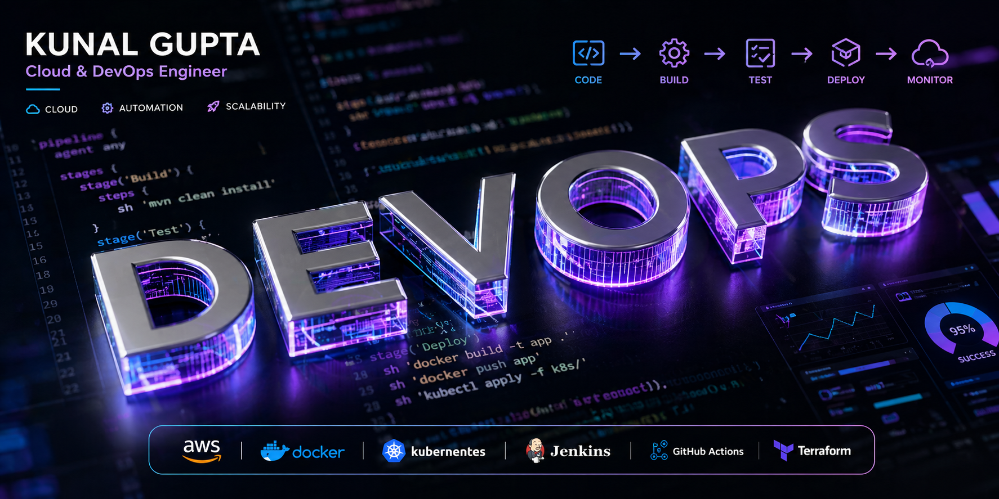

<!-- 🎨 Custom DevOps Banner -->

  

<!-- 🔥 Typing Animation -->

  

---

<!-- 📄 Resume Button -->

---

# 👋 Hi, I'm Kunal Gupta  

🚀 DevOps Engineer | ☁️ Certified SAA | Terraform | CI/CD (Jenkins, GitHub Actions) | Docker & Kubernetes | Cloud Automation | Monitoring (CloudWatch, Grafana)

  

---

> [!IMPORTANT]
> Cloud and DevOps Engineer with **2.5+ years of experience** in infrastructure automation, CI/CD pipelines, and scalable cloud deployments.

---

## 🚀 About Me  

- 💼 DevOps Engineer at **Tech Mahindra**  
- ☁️ AWS: EC2, S3, IAM, VPC, CloudWatch  
- ⚙️ CI/CD using Jenkins & GitHub Actions  
- 🏗️ Infrastructure as Code (Terraform)  
- 🐳 Docker-based deployments  
- 📊 Monitoring with CloudWatch & Grafana  
- 🔧 Strong Linux & troubleshooting skills  

---

## 🧩 Tech Stack  

---

## 🚀 Featured Projects  

### 🔥 Reverse Proxy CI/CD Multi-Service Architecture  

> [!TIP]
> End-to-end CI/CD pipeline using AWS + Docker + Nginx  

- 🔄 Automated deployment via GitHub Actions  
- ☁️ AWS Lambda + API Gateway integration  
- 🐳 Multi-container Docker architecture  
- 🌐 Nginx reverse proxy routing  

👉 https://github.com/Kunalv04/DevOps-Projects/tree/main/DevOps-Project-03  

---

## 📈 Contribution Graph  

  

---

## 🐍 Contribution Snake  

  

---

## 📜 Certifications  

- 🏆 [AWS Certified Solutions Architect – Associate](https://www.credly.com/badges/d4becd65-b084-40f3-be90-69f27c4874a0/public_url)  
- ☁️ [Google Cloud Computing Foundations](https://www.cloudskillsboost.google/public_profiles/016b4181-0795-4c25-a53b-5bf360757a93/badges/13130498)  
- 🤖 [GitHub Copilot Certification (GH-300)](https://learn.microsoft.com/api/credentials/share/en-us/KunalGupta-3238/EED6E4E9CC3458D9?sharingId=B95E3D6094EE3161)  
- 🧠 [Introduction to Generative AI](https://www.cloudskillsboost.google/public_profiles/016b4181-0795-4c25-a53b-5bf360757a93/badges/12630674)  

---

## 🤝 Connect With Me  

---

## ⚡ DevOps Philosophy  

> [!NOTE]
> Automate deployments. Ensure reliability. Scale systems efficiently. 🚀  

---
